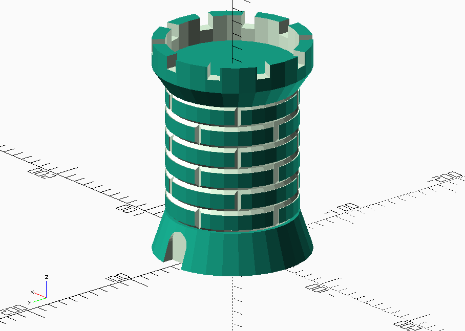

# OpenSCAD-castle-texture
OpenSCAD script to generate a castle tower
--------

Description
--------
OpenSCAD script capable of creating parametric castle towers with a brick texture.

Author
-----
Gustavo Segura(gsegura96). Dic-2016

Licencia
-----

 This work is licensed under a <a rel="license" href="http://creativecommons.org/licenses/by-sa/4.0/">Creative Commons Attribution-ShareAlike 4.0 International License</a>.

